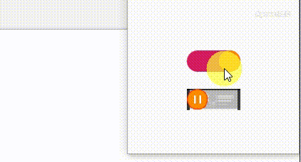

## ToggleY
> 开关按钮, 开与关的背景可以用颜色或图片.
> 如果对实现源码感兴趣可以参考我写的[博客](https://blog.csdn.net/MoLiao2046/article/details/104688165)
### 使用  
- 配置依赖, 在所在Module的build.gradle文件下
  ```groovy
   implementation 'com.yey.ty:library_tby:0.0.6'
  ```
  
- 属性释意
    ```xml
      当使用ToggleColorY,这些值对应为颜色id
      当使用ToggleImageY,这些值对应为图片id
      tby_open_bg:开关开时背景
      tby_close_bg:开关关时背景
      tby_touch:开关滑动按钮背景
      tby_state:开关目前状态为开或者关,对应值为ture或者false
    ```
    
- 使用颜色作为开关背景
    ```xml
     <com.yey.library_tby.ToggleColorY
         android:id="@+id/ytb_color"
         android:layout_width="100dp"
         android:layout_height="40dp"
         app:tby_close_bg="@color/black" 
         app:tby_open_bg="@color/red"
         app:tby_state="true"
         app:tby_touch="@color/yellow" />   
    ```
    
- 使用图片作为开关背景
    ```xml
     <com.yey.library_tby.ToggleImageY
         android:id="@+id/ytb_image"
         android:layout_width="100dp"
         android:layout_height="40dp"
         app:tby_close_bg="@mipmap/close"
         app:tby_open_bg="@mipmap/open"
         app:tby_touch="@mipmap/touche"
         app:tby_state="true" />   
    ```
    
- 代码
    ```java
    ((ToggleColorY) findViewById(R.id.ytb_color)).setOnClick(new OnClick() {
        @Override
        public void click(boolean isOpen) {
            Log.e("开关状态", String.valueOf(isOpen));
        }
    });
    ((ToggleImageY) findViewById(R.id.ytb_image)).setOnClick(new OnClick() {
        @Override
        public void click(boolean isOpen) {
            Log.e("开关状态", String.valueOf(isOpen));
        }
    });
    ```
    
- 效果图

    